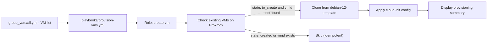

# ansible-role_vm-provisioning

[](https://github.com/Giremuu/ansible-role_vm-provisioning/actions/workflows/ci.yml)


First Ansible playbook with first CI/CD pipeline. Automates Proxmox VM provisioning by cloning a Debian 12 template and applying cloud-init configuration (IP, DNS, gateway, CPU, memory). Idempotent - skips VMs already marked as `created`.

---

## Overview



### Project structure

```
ansible-role_vm-provisioning/
├── ansible.cfg
├── requirements.yml                  - community.proxmox collection
├── playbooks/
│   └── provision-vms.yml
├── roles/create-vm/
│   ├── defaults/main.yml             - clone_id, proxmox_storage, proxmox_node
│   └── tasks/main.yml                - check, clone, cloud-init, summary
├── group_vars/
│   ├── all-exemple.yml               - VM list and network config template
│   └── vault-exemple.yml             - Proxmox credentials template
└── .github/workflows/
    └── ci.yml                        - yamllint, ansible-lint, syntax check
```

---

## Usage

### Prerequisites

- Ansible control node with network access to Proxmox
- A Debian 12 template on Proxmox (default `vmid: 200`)
- Proxmox API token

### Setup

```bash
# Install the Proxmox collection
ansible-galaxy collection install -r requirements.yml

# Copy and fill the variable files
cp group_vars/all-exemple.yml group_vars/all.yml
cp group_vars/vault-exemple.yml group_vars/vault.yml
ansible-vault encrypt group_vars/vault.yml
```

### Run

```bash
ansible-playbook playbooks/provision-vms.yml --ask-vault-pass
```

---

## Specificities

### VM configuration

Define VMs in `group_vars/all.yml`:

```yaml
default_gateway: 192.168.1.255
default_netmask: 24
dns_servers: "8.8.8.8,1.1.1.1"

vms:
  - name: vm-web01
    vmid: 100
    state: to_create
    ip: 192.168.1.10
    cores: 2
    memory: 2048

  - name: vm-prod01
    vmid: 150
    state: created    # already exists, will be skipped
    ip: 192.168.1.50
    cores: 2
    memory: 2048
```

| Field | Required | Default | Description |
|---|---|---|---|
| `name` | yes | - | VM name in Proxmox |
| `vmid` | yes | - | Proxmox VM ID |
| `state` | yes | - | `to_create` or `created` |
| `ip` | yes | - | Static IP address |
| `cores` | no | `1` | vCPU count |
| `memory` | no | `1024` | RAM in MB |

### Idempotency

The role checks existing VMs on Proxmox before any action. A VM is skipped if:
- `state` is `created`, or
- its `vmid` already exists on the node

This makes it safe to re-run the playbook without duplicating VMs.

### Role defaults

Defined in `roles/create-vm/defaults/main.yml`:

| Variable | Default | Description |
|---|---|---|
| `clone_id` | `200` | Template VMID to clone from |
| `proxmox_storage` | `local-lvm` | Target storage |
| `proxmox_node` | `proxmox` | Target node name |

### CI/CD

Runs on every push and pull request to `master`:

| Step | Tool |
|---|---|
| YAML syntax validation | yamllint |
| Ansible best practices | ansible-lint |
| Playbook syntax check | ansible-playbook --syntax-check |

---

## License

MIT - see [LICENSE](LICENSE) for details.
